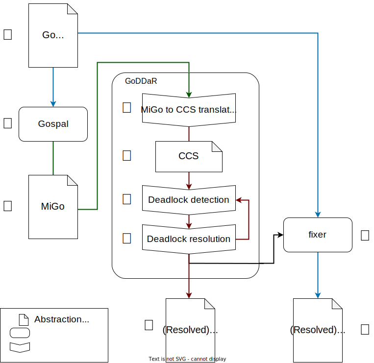

# GoDDaR
A tool for static **D**eadlock **D**etection **a**nd **R**esolution in **Go** Programs.

This is the implementation of the tool, developed as part of my master's thesis, for statically
detecting and resolving deadlocks in Go programs.

## Features

* Fully automated workflow
* Deadlock analysis with no code annotations required
* Supports the most commonly used Go features
  * Synchronous channels
  * Select statement
  * Recursion/loops
* Deadlock resolution on the original Go code
  * With heuristic to prevent changing the program in undesired ways


### Still unsupported features:
* Asynchronous channels
* Channel passing (channels inside channels)
* Channel closure

## Workflow

<p align="center">  </p>

The general workflow of the tool is as follows:
From the Go source code (❶), using a slightly modified version of the
[Gospal](https://github.com/JorgeGCoelho/gospal) program analysis framework (❷) a simpler representation
of the Go program is obtained (❸). From the simpler MiGo representation, our tool translates the MiGo
into the form of a [CCS](https://en.wikipedia.org/wiki/Calculus_of_communicating_systems) expression (❹). 
Over the CCS representation of the Go program, the tool performs static analysis to determine if any
deadlock exists (❺). For each deadlock found, one of two strategies can be applied to resolve the deadlock (❻).
GoDDaR repeats through the deadlock detection and resolution steps (❺ and ❻) until no deadlocks are found.
The resulting resolved program can be returned in CCS form (❼), or, with the help of another tool (❽),
the resolved program can also be return the Go code form (❾).


#### Components:

* GoDDaR
* fixer
  * Located in the `./fixer` directory
* gospal
  * Located in the following repository https://github.com/JorgeGCoelho/gospal

### Requirements:

This approach makes use of components written in OCaml and Go, and as such, the usual minimal development tools are required.
For OCaml, the `dune` build system is required to build the GoDDaR tool.
For Go, only the `go` tool is required.

```
wget https://go.dev/dl/go1.22.2.linux-amd64.tar.gz
sudo rm -rf /usr/local/go && sudo tar -C /usr/local -xzf go1.22.2.linux-amd64.tar.gz
export PATH=$PATH:/usr/local/go/bin
```

### Installation:

* Install ocaml/opam/dune
```
sudo apt update && sudo apt install gcc build-essential curl unzip bubblewrap
sudo bash -c "sh <(curl -fsSL https://raw.githubusercontent.com/ocaml/opam/master/shell/install.sh)"
opam init
eval $(opam env --switch=default)
opam install dune
```

* Build and install migoinfer (included in gospal): https://github.com/JorgeGCoelho/gospal
  * Make sure the `migoinfer` binary is located in `$PATH`
```
git clone https://github.com/JorgeGCoelho/gospal
cd gospal/cmd/migoinfer/
git checkout v2.0.2 
go build
export PATH=$PATH:~/gospal/cmd/migoinfer 
```

Caution about your `GOPATH` environment variable.


* Clone GoDDaR git repository
```
git clone https://github.com/JorgeGCoelho/GoDDaR.git
```
* Build GoDDaR
```
cd GoDDaR
opam install menhir
dune build
dune exec -- GoDDaR --help
```
* (Optional) For automatic patching of Go code, installation of the `fixer` program is necessary.
```
$ cd fixer
$ go install GoDDaR_fixer
```
Make sure the resulting `GoDDaR_fixer` executable is in `$PATH`

## Usage 
### Modes of operation

GoDDaR is can analyse programs in three different representations: Go, MiGo and CCS.
The tool has a subcommand to process each representation:
| Representation | Command                   |
|----------------|---------------------------|
| Go             | `GoDDaR go <Go file>`     |
| MiGo           | `GoDDaR migo <MiGo file>` |
| CCS            | `GoDDaR ccs <process>`    |

### Example usage
TODO: explain output

```
Usage: ./GoDDaR [-v | -ds ] [ccs <process> | migo <MiGo file> | go [-patch] <Go file>]
  -v Output extra information
  -ds Select deadlock resolution algorithm (1 or 2)
  -help  Display this list of options
  --help  Display this list of options
```

Analyse CCS process:
```
$ dune exec GoDDaR ccs 'a!.b?.0 || b!.a?.0'
---- 1 ----
    (a!.b?.0 || b!.a?.0)

Deadlocks:
---- 1 ----
    (a!.b?.0 || b!.a?.0)
Resolved:
    ((a!.0 || b?.0) || (b!.0 || a?.0))
```

Analyse MiGo type:
```
$ dune exec GoDDaR migo test/data/benchmark/bad-order-circular/main.migo
---- 1 ----
(t0!.t1?.0 || t1!.t0?.0)

Deadlocks:
---- 1 ----
(t0!.t1?.0 || t1!.t0?.0)
Resolved:
((t0!.0 || t1?.0) || (t1!.0 || t0?.0))
```

Analyse Go:
```
--- 1 ---
    (t3!.t1?.0 || t1!.t3?.0)


Deadlocks:
--- 1 ---
    (t3!.t1?.0 || t1!.t3?.0)
Fully Resolved:
(t3!.t1?.0 || (t1!.0 || t3?.0))


--- test/data/go_fixer/circular/main.go
+++ fixed/test/data/go_fixer/circular/main.go
@@ -4,7 +4,9 @@
        a := make(chan struct{})
        b := make(chan struct{})
        go func() {
-               a <- struct{}{}
+               go func() {
+                       a <- struct{}{}
+               }()
                <-b
        }()
        b <- struct{}{}
```

For more examples check the directory `tests/` (TODO)

## Publications

* [Master's thesis](assets/Jorge%20Coelho%20-%20Master's%20Dissertation.pdf)
